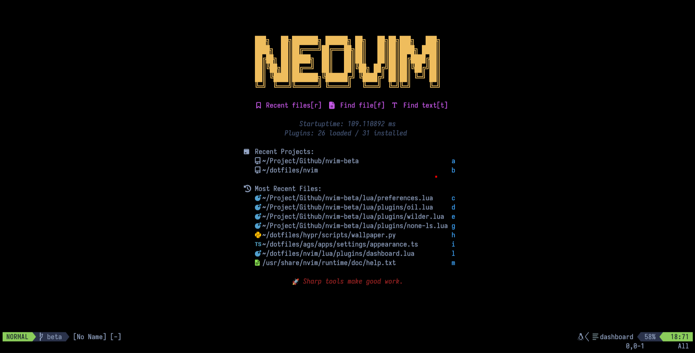

<p align="center">
  
</p>

<h1 align="center">NVIM</h1>

<p align="center">

  <a href="https://github.com/S4NKALP/nvim/blob/main/LICENSE">
 </a>

<a href="https://github.com/S4NKALP/nvim/graphs/contributors">
 </a>

<a href="https://github.com/S4NKALP/nvim/stargazers">
</a>

<a href="https://github.com/S4NKALP/nvim/network/members">
 </a>

<a href="https://github.com/S4NKALP/nvim/watchers">
 </a>

<a href="https://github.com/S4NKALP/nvim/pulse">
 </a>
</p>

<p align="center">
  <strong>Personalized Dev Env ❤️👨‍💻</strong>
  <br>
    Handcrafted Neovim setup for the ultimate CLI dev experience.
  <br>
  <br>
  <a href="https://github.com/S4NKALP/nvim/wiki">Documentation</a>
  ·
  <a href="https://github.com/S4NKALP/nvim/issues">Report a Bug</a>
  ·
  <a href="https://github.com/S4NKALP/nvim/issues">Request a Feature</a>
</p>

<br>

## System dependencies

Important system dependencies:

- **Nerd fonts** ([information source](https://gist.github.com/matthewjberger/7dd7e079f282f8138a9dc3b045ebefa0)):

  - Download a [Nerd Font](https://www.nerdfonts.com/) (good choice is "JetBrainsMono Nerd Font").
  - Unzip and copy to '~/.local/share/fonts'.
  - Run the command `fc-cache -fv` to manually rebuild the font cache.

- **Tools for finding stuff**:
  - [ripgrep](https://github.com/BurntSushi/ripgrep#installation)

## Installation

Delete old nvim configuration

```bash
rm -rf ~/.config/nvim
rm -rf ~/.local/state/nvim
rm -rf ~/.local/share/nvim
```

Clone the repository to ~/.config

```bash
git clone --filter=blob:none https://github.com/amanhex/nvim.git ~/.config/nvim
```

Run neovim to complete the setup

```bash
nvim
```

### 🧰 Tools Used

- [dots](https://github.com/S4NKALP/hyprland) — Dev Environment
- [nvim](https://github.com/S4NKALP/nvim) — Personalized Editor

<div align="center">
    <strong>⭐ hit the star button if you found this useful ⭐</strong><br>
</div>
